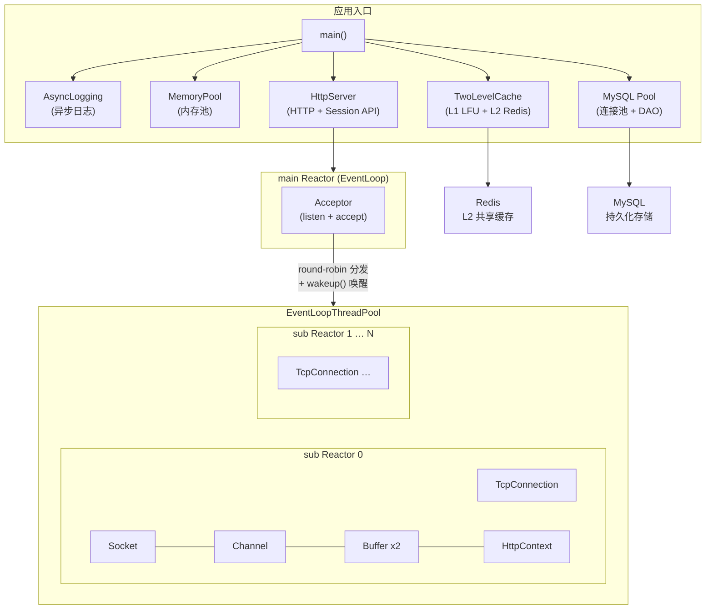
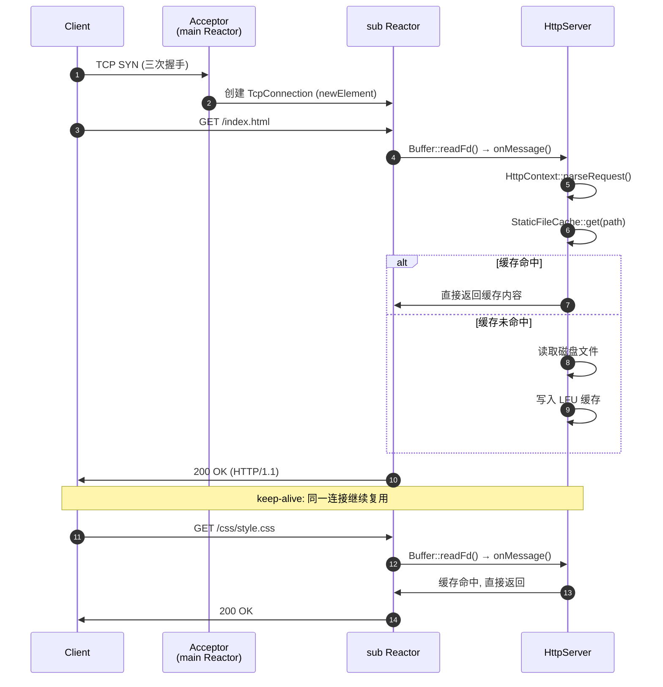
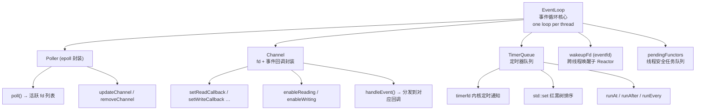
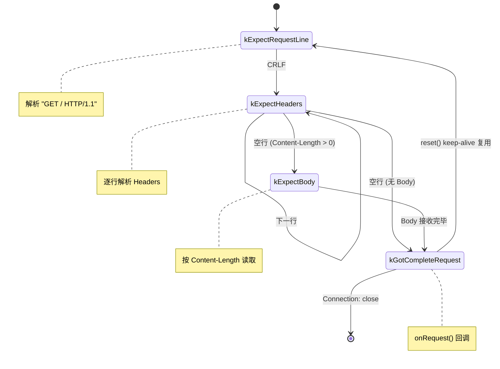
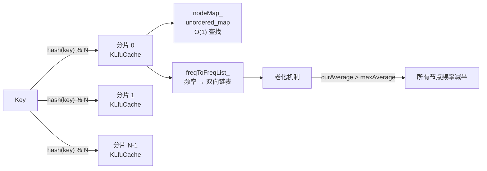
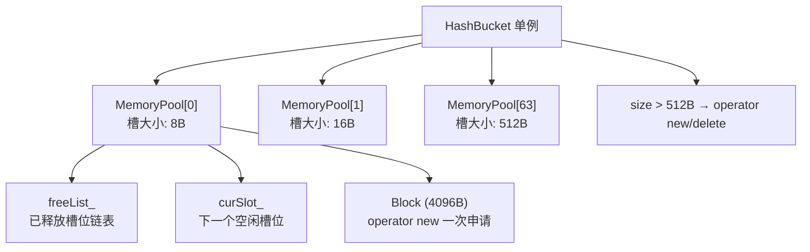
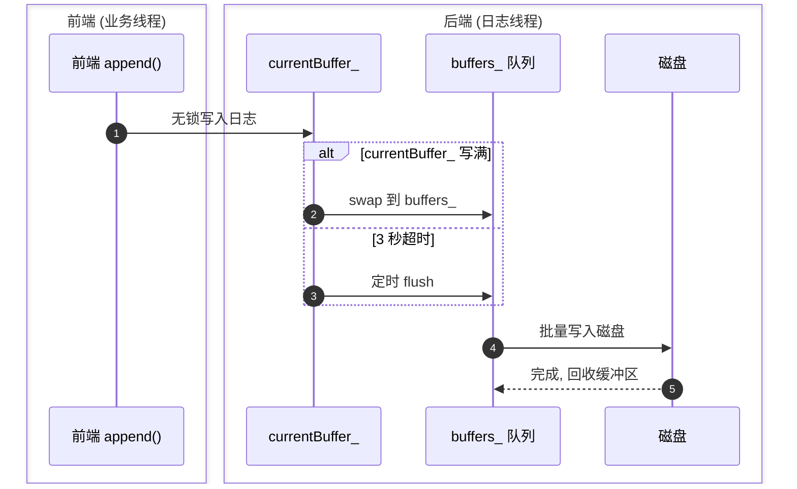
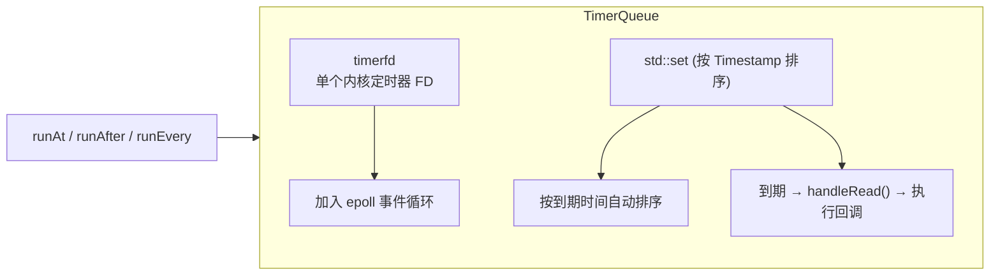
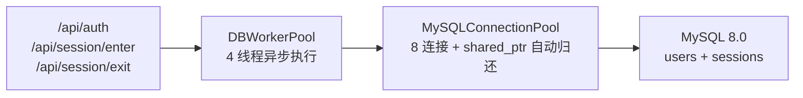
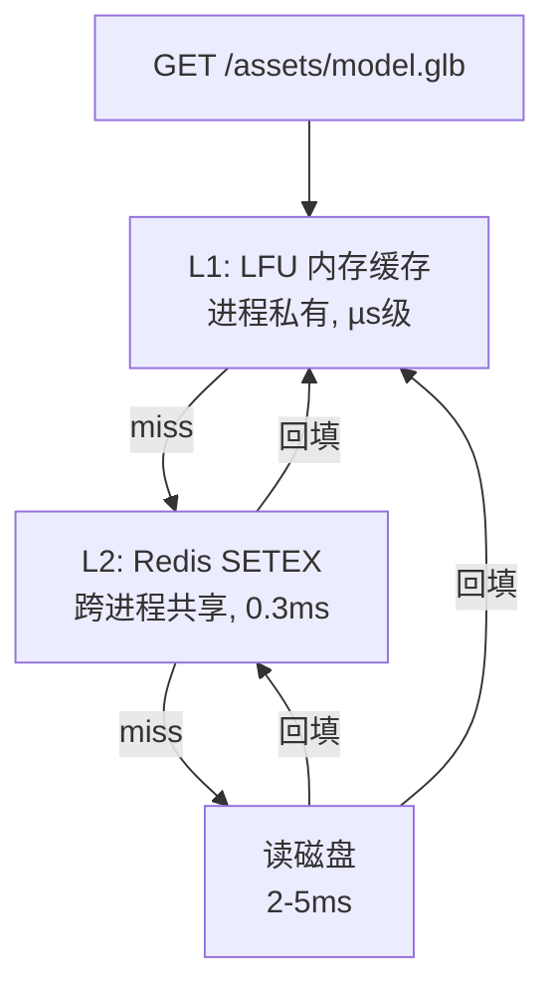

# 高性能 C++ 网络服务器｜Multi-Reactor

[](https://kernel.org)
[](https://isocpp.org)
[](https://cmake.org)
[](LICENSE)

支持 AR 协同渲染服务**多Reactor 模型**的 C++11 高性能 Web 服务器，参考 [muduo](https://github.com/chenshuo/muduo) 网络库设计，支持 HTTP/1.1、内存池、LFU 缓存、MySQL 持久化、Redis 两级缓存、异步日志、AR 协同会话管理。

> 🚀 **长连接峰值 9.8 万 QPS** | 短连接 4.2k QPS（localhost, LFU 缓存命中）  
> 🎯 **P50 延迟 138µs** | P99 延迟 492µs（c=10, 无日志）  
> 🧵 **多线程 One Loop Per Thread** | 🔐 注册/登录 + 场景会话管理

---

## 目录

- [特性](#特性)
- [架构](#架构)
- [快速开始](#快速开始)
- [AR 场景会话 API](#ar-场景会话-api)
- [性能压测](#性能压测)
- [核心模块](#核心模块)
  - [Reactor 事件驱动](#1-reactor-事件驱动)
  - [HTTP 协议层](#2-http-协议层)
  - [LFU 缓存](#3-哈希分片-lfu-缓存)
  - [内存池](#4-固定大小槽位内存池)
  - [异步日志](#5-双缓冲异步日志)
  - [定时器](#6-timerfd--红黑树定时器)
  - [MySQL 持久化](#7-mysql-持久化与会话管理)
  - [Redis 两级缓存](#8-redis-两级缓存)
- [目录结构](#目录结构)
- [使用示例](#使用示例)
- [依赖与编译](#依赖与编译)
- [压测脚本](#压测脚本)
- [参考资料](#参考资料)
- [License](#license)

---

## 特性

### 网络框架

| 特性 | 实现 |
|------|------|
| **事件模型** | Epoll ET/LT 模式，非阻塞 IO |
| **线程模型** | One Loop Per Thread（主线程 Accept + 多工作线程 IO） |
| **连接管理** | `shared_ptr` + `enable_shared_from_this` 保证生命周期安全 |
| **缓冲区** | 仿 muduo `Buffer`，`readv` 分散读减少系统调用 |
| **零拷贝** | `sendfile()` 实现文件发送 |
| **优雅关闭** | 半连接 shutdown 确保数据完整发送 |

### 协议与缓存

| 特性 | 实现 |
|------|------|
| **HTTP/1.1** | 增量解析 + Keep-Alive 长连接，per-connection HttpContext |
| **LFU 缓存 (L1)** | 哈希分片 + 频率老化机制，进程私有 µs 级命中 |
| **Redis 缓存 (L2)** | 两级缓存协调，跨进程共享，穿透/击穿/雪崩保护 |
| **静态文件服务** | 内存缓存 + mtime 校验自动失效 |

### 持久化与会话

| 特性 | 实现 |
|------|------|
| **MySQL 连接池** | 8 连接 + 保活机制 + borrow/recycle 自动归还 |
| **异步 DB 线程池** | DBWorkerPool (4 线程)，不阻塞 EventLoop |
| **Session 管理** | 注册/登录合一，场景进入/退出，status 状态机 |
| **DAO 层** | 预处理语句防注入，SessionDAO + User 数据结构 |

### 基础设施

| 特性 | 实现 |
|------|------|
| **内存池** | 64 级固定大小槽位 (8–512B)，线程安全，per-connection 分配 |
| **异步日志** | 双缓冲前后端分离，前端无锁写入，后端批量刷盘 |
| **定时器** | `timerfd` + `std::set` 红黑树，支持一次性/周期性任务 |

---

## 架构

### 系统总览



### 请求处理流水线



---

## 快速开始

### 环境要求

- **Linux** (需要 epoll)
- **CMake** >= 3.0
- **GCC** >= 4.8 或 Clang >= 3.3 (支持 C++11)
- **MySQL** >= 5.7 (可选，持久化会话数据)
- **Redis** >= 5.0 (可选，L2 共享缓存)
- **hiredis** (可选，Redis C 客户端)

```bash
# 安装依赖
sudo apt install libmysqlclient-dev libhiredis-dev redis-server mysql-server -y
```

### 编译

```bash
git clone https://github.com/yourname/webserver.git
cd webserver

# 编译（自动检测 MySQL/hiredis，缺失则跳过对应模块）
cd build && cmake .. -DCMAKE_BUILD_TYPE=Release && make -j$(nproc)
```

### 运行

```bash
# 从项目根目录运行（静态文件根目录需要相对路径 www/）
cd ..
./bin/main

# 输出:
# ================================================Start Web Server================================================
# Listening on http://localhost:8080/
# Static files root: www/
# LFU cache capacity: 200 files
# Memory pool: initialized
# MySQL + DBWorkerPool initialized       (如果安装了 libmysqlclient-dev)
# Redis + TwoLevelCache initialized       (如果安装了 libhiredis-dev)
```

### 数据库初始化

```bash
# 连接 MySQL 并建库建表
mysql -u root -p <<EOF
CREATE DATABASE IF NOT EXISTS webserver;
USE webserver;
CREATE TABLE IF NOT EXISTS users (
    id          BIGINT AUTO_INCREMENT PRIMARY KEY,
    username    VARCHAR(64) NOT NULL UNIQUE,
    passwd_hash VARCHAR(256) NOT NULL,
    created_at  DATETIME DEFAULT CURRENT_TIMESTAMP
);
CREATE TABLE IF NOT EXISTS sessions (
    id            BIGINT AUTO_INCREMENT PRIMARY KEY,
    session_token VARCHAR(128) NOT NULL,
    user_id       BIGINT NOT NULL,
    scene_id      VARCHAR(64) DEFAULT '',
    status        TINYINT DEFAULT 0,
    created_at    DATETIME DEFAULT CURRENT_TIMESTAMP,
    updated_at    DATETIME DEFAULT CURRENT_TIMESTAMP ON UPDATE CURRENT_TIMESTAMP,
    FOREIGN KEY (user_id) REFERENCES users(id)
);
EOF
```

### 测试

```bash
# 访问首页
curl http://localhost:8080/

# 静态文件
curl http://localhost:8080/css/style.css
curl http://localhost:8080/js/app.js

# 带查询参数
curl "http://localhost:8080/?name=world"

# 查看响应头
curl -si http://localhost:8080/
```

---

## AR 场景会话 API

MySQL 持久化 + Redis 缓存加持下的 AR 协同场景会话管理。

| API | 方法 | 说明 | SQL |
|-----|------|------|-----|
| `/api/auth?username=xx&password=yy` | POST | 注册/登录合一，返回 session token | `SELECT` / `INSERT users` + `INSERT sessions` |
| `/api/session/enter?token=xx&scene=N` | POST | 进入场景 (status=1, scene_id=N) | `UPDATE sessions` |
| `/api/session/exit?token=xx` | POST | 退出场景 (status=0, scene_id 清空) | `SELECT status` → `UPDATE sessions` |
| `/api/session?token=xx` | GET | 查询会话状态 | `SELECT` sessions 全字段 |

场景编号：1-苔蚀巨神废墟、2-深空失联观测站、3-烟雨枫桥渡、4-灰霾地铁避难所、5-霓虹黑市深巷。

浏览器 Demo：启动服务器后访问 `http://localhost:8080/`，输入用户名密码即可体验完整认证 → 进入场景 → 退出场景 → 请求日志流程。


## 性能压测

> 测试环境：AMD Ryzen 9 7945HX (32 核)、7.6GB RAM、WSL2 (Ubuntu)、g++ 11.4.0 -O2、关闭异步日志  
> 测试工具：[wrk](https://github.com/wg/wrk) (长连接) + [ab](https://httpd.apache.org/docs/2.4/programs/ab.html) (短连接)  
> 测试目标：`/js/app.js`（959B，LFU 缓存预热后）  
> 完整报告：[benchmark/benchmark.md](benchmark/benchmark.md)

### 长连接 (HTTP/1.1 Keep-Alive)

| 并发 | QPS | P50 | P90 | P99 | Avg | 错误 |
|------|-----|-----|-----|-----|-----|------|
| 10 | 49,396 | 138µs | 276µs | 492µs | 161µs | 0 |
| 50 | 73,302 | 500µs | 820µs | 1.28ms | 551µs | 0 |
| 100 | **97,871** | 0.95ms | 1.38ms | 2.11ms | 1.01ms | 0 |
| 200 | 74,468 | 2.12ms | 2.65ms | 4.06ms | 2.19ms | 0 |
| 500 | 95,077 | 5.15ms | 5.95ms | 7.24ms | 5.23ms | 0 |

### 短连接 (HTTP/1.0, 每请求新 TCP)

| 并发 | QPS | Total | Connect | Process | 失败 |
|------|-----|-------|---------|----------|------|
| 10 | 4,094 | 2ms | 0ms | 2ms | 0 |
| 50 | **4,225** | 12ms | 0ms | 12ms | 0 |
| 100 | 4,209 | 23ms | 0ms | 23ms | 0 |
| 200 | 4,134 | 47ms | 0ms | 47ms | 0 |
| 500 | 4,065 | 116ms | 1ms | 115ms | 0 |

### 性能画像

```
IO 吞吐 (长连接):    ████████████████████████████████████  97,871 req/s
TCP建连+IO (短连接):  ██                                    4,225 req/s
长/短比值:           ~4%
```

> **长连接 QPS 约为短连接的 24 倍**。差值来自 TCP 三次握手/四次挥手 + 每请求创建销毁 `TcpConnection` 的开销。短连接 `Process` 耗时包含完整链路：`accept()` → `HttpContext::parseRequest()` → `StaticFileCache::get()` → `send()` → `shutdown()`。Connect 趋近 0ms 是因为 localhost 测试无网络延迟。

---

## 核心模块

### 1. Reactor 事件驱动



**关键设计决策：**

- `wakeupFd`（eventfd）— 跨线程唤醒：主线程将新连接分发给子线程时，通过 `wakeup()` 唤醒阻塞在 `epoll_wait` 的子线程
- `pendingFunctors` — 线程安全任务队列：非 IO 线程通过 `queueInLoop()` 向目标 EventLoop 投递任务
- `tie()` — 生命周期保障：Channel 持有上层对象的 `weak_ptr`，回调前 `lock()` 检查对象是否存活

### 2. HTTP 协议层



**增量解析（零拷贝）：**
- 直接在 `Buffer::peek()` 上操作，不拷贝临时字符串
- 处理 TCP 流式特性：一次 `onMessage` 可能只收到半行请求行，状态机自动等待更多数据

**per-connection 上下文：**
- `HttpContext` 作为 `TcpConnection` 成员，每连接独立持有，消除多线程共享 map 的数据竞争
- 连接关闭时随 `TcpConnection` 析构自动回收，无需手动清理

**keep-alive 复用：**
- `HttpContext::reset()` 通过 `swap()` 快速重置解析状态，复用已分配的内存
- HTTP/1.0 默认短连接，HTTP/1.1 默认长连接（均按标准处理 `Connection` 头）

### 3. 哈希分片 LFU 缓存



| 设计选择 | 说明 |
|----------|------|
| 分片 | 按 key hash 分散到 N 个独立 KLfuCache，多线程无锁竞争 |
| LFU 而非 LRU | 适合静态文件场景——访问频率比时间局部性更重要 |
| 频率老化 | 防止曾经热门但现在不再访问的旧文件长期占用缓存 |

### 4. 固定大小槽位内存池



**已集成点：**

| 对象 | 大小 | 每连接分配次数 | 集成方式 |
|------|------|---------------|----------|
| `Socket` | ~8B | 1 | `std::unique_ptr<Socket, SocketDeleter>` |
| `Channel` | ~176B | 1 | `std::unique_ptr<Channel, ChannelDeleter>` |

通过 `memoryPool::newElement<T>(args...)` 分配、`memoryPool::deleteElement(ptr)` 回收，配合自定义 `unique_ptr` deleter 实现透明集成。高并发短连接场景下，每秒可避免数千次系统 `malloc`/`free` 调用。

### 5. 双缓冲异步日志



- **前端零开销**：业务线程直接追加到预分配的 4MB 大缓冲区，无需每次 `fwrite`
- **3 秒 flush**：即使缓冲区未满也定期刷盘，保证日志不丢失
- **滚动**：按文件大小自动切分（默认 1MB）

### 6. timerfd + 红黑树定时器



- **O(log N)** 插入删除，**O(1)** 获取最早到期任务
- `timerfd` 将定时事件统一到 epoll 事件循环中，无需独立线程
- 支持一次性任务 (`interval=0`) 和周期性任务 (`interval>0`)

### 7. MySQL 持久化与会话管理



**连接池设计：**

- `shared_ptr<MYSQL>` + 自定义 deleter 自动 `recycle()` 归还，与内存池 `unique_ptr + ChannelDeleter` 一脉相承
- 保活：`TimerQueue::runEvery(300s, keepAliveFunc)` 每 5 分钟 ping 空闲连接
- 降级：`borrow()` 超时 3s 返回 `nullptr`，调用方穿透到下一层

**异步 DB 执行：**

- DBWorkerPool（4 线程）独立执行阻塞 SQL，`std::promise/future` 桥接同步等待（5s 超时）
- 关键：DB 操作不阻塞 EventLoop 线程，epoll_wait 不受影响
- 线程数 = 连接池大小，避免连接闲置

**Session 状态机：**

```
认证(status=0) → 进入场景(status=1, scene_id=1~5) → 退出(status=0, scene_id清空) → 重新进入...
```

**两表 ER：**

```
users (id, username, passwd_hash, created_at)
  │ 1:N
  ▼
sessions (id, session_token, user_id FK, scene_id, status, created_at, updated_at)
```

### 8. Redis 两级缓存



**两级缓存协调器 `TwoLevelCache`：**

| 机制 | 实现 |
|------|------|
| 读路径 | L1(µs) → L2 Redis(0.3ms) → 磁盘(2-5ms)，任一层不可用穿透到下一层 |
| 写路径 | L1 put + L2 SETEX (同步，localhost ~0.3ms，磁盘 IO 后顺带写入可接受) |
| 雪崩保护 | TTL = 3600 + hash(key) % 300，批量缓存不会同时过期 |
| 穿透保护 | 不存在 key 缓存 30s 空值标记，阻止无效请求打到磁盘 |
| 击穿保护 | 同 key 重建互斥锁，仅一个线程执行磁盘 IO，其余等待或返回旧值 |

**多实例部署时**，Redis 作为缓存一致性锚点——任何实例 L1 miss 都从 Redis 补齐并回填本地 L1。

---

## 目录结构

```
webserver/
├── CMakeLists.txt                   # 顶层 CMake 配置
├── README.md
├── LICENSE
├── .gitignore
├── compile_commands.json            # clangd 代码补全 (cmake 生成)
│
├── include/                         # 头文件
│   ├── base/                        #   基础工具
│   │   ├── noncopyable.h            #     禁止拷贝基类
│   │   ├── Thread.h                 #     POSIX 线程封装
│   │   ├── CurrentThread.h          #     获取当前线程 ID
│   │   └── Timestamp.h              #     时间戳
│   │
│   ├── net/                         #   网络核心
│   │   ├── EventLoop.h              #     One Loop Per Thread
│   │   ├── EventLoopThread.h        #     EventLoop 线程封装
│   │   ├── EventLoopThreadPool.h    #     线程池 (round-robin 分发)
│   │   ├── Poller.h / EPollPoller.h #     epoll 多路复用
│   │   ├── Channel.h                #     fd + 事件回调封装
│   │   ├── TcpServer.h              #     TCP 服务器外观类
│   │   ├── TcpConnection.h          #     单个 TCP 连接全生命周期(含 HttpContext)
│   │   ├── Acceptor.h               #     listen + accept
│   │   ├── Socket.h                 #     socket 操作封装
│   │   ├── Buffer.h                 #     应用层缓冲区
│   │   ├── InetAddress.h            #     IP + 端口封装
│   │   └── Callbacks.h              #     回调类型定义
│   │
│   ├── http/                        #   HTTP 协议层
│   │   ├── HttpServer.h             #     HTTP 服务器外观类
│   │   ├── HttpContext.h            #     增量 HTTP 解析状态机(per-connection)
│   │   ├── HttpRequest.h            #     HTTP 请求数据载体
│   │   ├── HttpResponse.h           #     HTTP 响应构建器
│   │   └── StaticFileCache.h        #     LFU 静态文件缓存
│   │
│   ├── log/                         #   异步日志
│   │   ├── Logger.h                 #     日志宏 (LOG_INFO, LOG_FATAL…)
│   │   ├── AsyncLogging.h           #     双缓冲异步日志后端
│   │   ├── LogStream.h              #     流式日志格式化
│   │   ├── LogFile.h                #     日志文件滚动
│   │   ├── FixedBuffer.h            #     固定大小缓冲区模板
│   │   └── FileUtil.h               #     文件写入封装
│   │
│   ├── timer/                       #   定时器
│   │   ├── Timer.h                  #     定时器对象
│   │   └── TimerQueue.h             #     timerfd + std::set 红黑树定时器队列
│   │
│   ├── db/                          #   MySQL 持久化层
│   │   ├── MySQLConnectionPool.h    #     MySQL 连接池
│   │   ├── DBWorkerPool.h           #     异步 DB 工作线程池
│   │   └── SessionDAO.h             #     用户/会话 DAO
│   │
│   ├── cache/                       #   Redis 两级缓存
│   │   ├── RedisConnectionPool.h    #     Redis 连接池
│   │   └── TwoLevelCache.h          #     L1 LFU + L2 Redis 协调器
│   │
│   ├── memoryPool.h                 #   内存池 (64 级固定槽位)
│   ├── LFU.h                        #   LFU 缓存 (KLfuCache + KHashLfuCache)
│   └── KICachePolicy.h              #   缓存策略抽象接口
│
├── src/                             # 源文件
│   ├── main.cpp
│   ├── DefaultPoller.cpp            #   Poller 工厂 (创建 EPollPoller)
│   ├── base/
│   │   ├── CurrentThread.cpp
│   │   ├── Thread.cpp
│   │   └── Timestamp.cpp
│   ├── net/
│   │   ├── Acceptor.cpp
│   │   ├── Buffer.cpp
│   │   ├── Channel.cpp
│   │   ├── EPollPoller.cpp
│   │   ├── EventLoop.cpp
│   │   ├── EventLoopThread.cpp
│   │   ├── EventLoopThreadPool.cpp
│   │   ├── InetAddress.cpp
│   │   ├── Poller.cpp
│   │   ├── Socket.cpp
│   │   ├── TcpConnection.cpp
│   │   └── TcpServer.cpp
│   ├── http/
│   │   ├── HttpContext.cpp
│   │   ├── HttpRequest.cpp
│   │   ├── HttpResponse.cpp
│   │   └── HttpServer.cpp
│   ├── log/
│   │   ├── AsyncLogging.cpp
│   │   ├── FileUtil.cpp
│   │   ├── LogFile.cpp
│   │   ├── LogStream.cpp
│   │   └── Logger.cpp
│   ├── db/
│   │   ├── MySQLConnectionPool.cpp
│   │   ├── DBWorkerPool.cpp
│   │   └── SessionDAO.cpp
│   ├── cache/
│   │   ├── RedisConnectionPool.cpp
│   │   └── TwoLevelCache.cpp
│   └── timer/
│       ├── Timer.cpp
│       └── TimerQueue.cpp
│
├── memory/                          # 内存池实现
│   ├── CMakeLists.txt
│   └── memoryPool.cc
│
├── www/                             # 静态文件根目录
│   ├── index.html
│   ├── css/
│   │   └── style.css
│   └── js/
│       └── app.js
│
├── benchmark/                       # 压测工具
│   ├── long_conn.sh                 #   长连接压测 (wrk)
│   ├── short_conn.sh                #   短连接压测 (ab)
│   ├── test_ar_scene.sh             #   AR 场景切换模拟测试
│   ├── benchmark.md                 #   压测完整报告
│   └── results/                     #   压测原始日志
│
├── tests/                           # 测试用例
├── build/                           # CMake 构建目录
├── bin/                             # 可执行文件输出
├── lib/                             # 共享库输出 (.so)
└── logs/                            # 运行时日志文件
```

---

## 使用示例

### 基础 HTTP 服务

```cpp
#include <http/HttpServer.h>

int main() {
    EventLoop loop;
    InetAddress addr(8080);
    HttpServer server(&loop, addr, "HttpServer");
    server.setThreadNum(4);

    server.setHttpCallback([](const HttpRequest& req, HttpResponse* resp) {
        resp->setContentType("application/json; charset=utf-8");
        resp->setBody(R"({"status":"ok","path":")" + req.path() + "\"}");
    });

    server.start();
    loop.loop();
}
```

### 注册连接回调

```cpp
server.setConnectionCallback([](const TcpConnectionPtr& conn) {
    if (conn->connected())
        LOG_INFO << "New connection from " << conn->peerAddress().toIpPort();
    else
        LOG_INFO << "Connection closed: " << conn->peerAddress().toIpPort();
});
```

### 使用 LFU 缓存

```cpp
#include <http/StaticFileCache.h>

// 创建缓存：200 个文件，自动分片
StaticFileCache cache(200);

CachedFileEntry entry;
if (cache.get("/index.html", entry)) {
    // 缓存命中 → 直接使用 entry.content, entry.contentType
} else {
    // 未命中 → 从磁盘读取，写入缓存
    std::string content = readFile("/index.html");
    cache.put("/index.html",
        CachedFileEntry(content, "text/html", mtime, content.size()));
}
```

### 使用内存池

```cpp
#include "memoryPool.h"

// 初始化（只需调用一次）
memoryPool::HashBucket::initMemoryPool();

// 通过 newElement / deleteElement 分配回收
auto* obj = memoryPool::newElement<MyClass>(arg1, arg2);
// 使用 obj ...
memoryPool::deleteElement(obj);

// 配合 unique_ptr + 自定义 deleter
struct MyDeleter {
    void operator()(MyClass* p) const { memoryPool::deleteElement(p); }
};
std::unique_ptr<MyClass, MyDeleter> ptr(memoryPool::newElement<MyClass>());
```

---

## 依赖与编译

### 依赖

| 依赖 | 说明 |
|------|------|
| **Linux kernel** >= 2.6.27 | epoll, eventfd, timerfd |
| **CMake** >= 3.0 | 构建系统 |
| **GCC** >= 4.8 或 **Clang** >= 3.3 | C++11 支持 |
| **pthread** | 多线程 |

### 编译选项

```bash
# Debug 构建 (含调试符号)
cmake .. -DCMAKE_BUILD_TYPE=Debug

# Release 构建 (优化)
cmake .. -DCMAKE_BUILD_TYPE=Release

# 生成 compile_commands.json (供 clangd/IDE 使用)
cmake .. -DCMAKE_EXPORT_COMPILE_COMMANDS=ON

# 多线程编译
make -j$(nproc)
```

---

## 压测脚本

```bash
# 1. 启动服务器
./bin/main > /dev/null 2>&1 &

# 2. 长连接压测 (wrk, HTTP/1.1 keep-alive)
./benchmark/long_conn.sh /js/app.js

# 3. 短连接压测 (ab, HTTP/1.0, 每请求新 TCP)
./benchmark/short_conn.sh /js/app.js

# 报告保存在
ls benchmark/results/long_conn_*.log
ls benchmark/results/short_conn_*.log

# 完整压测报告
cat benchmark/benchmark.md
```

两个脚本各跑各的，互不干扰。每个脚本 5 个并发梯度（10/50/100/200/500），结果输出到 `benchmark/results/`。

---

## 参考资料

- [《Linux 多线程服务端编程》](https://book.douban.com/subject/20471211/) — 陈硕著，muduo 设计思想

---

## License

MIT © [wsy258-strar](https://github.com/wsy258-strar)
